## On this page

* [Overview](#overview)
* [Required Hardware](#required-hardware)
* [Prerequisites](#prerequisites)
* [Step-by-step Guide](#lets-get-started)

---

## Overview

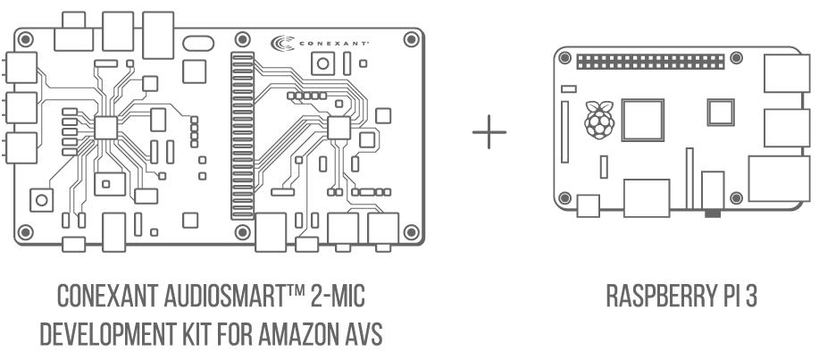

This guide provides step-by-step instructions for setting up an Alexa prototype using a **Conexant AudioSmart 2-Mic Development Kit for Amazon AVS** and a **Raspberry Pi**. It demonstrates how to access and test AVS using the Conexant development kit, our Java sample app (running on the Raspberry Pi), a Node.js server for authorization (running on the Raspberry Pi), and a third-party wake word engine that responds to "Alexa" (running on either the Development Kit or the Raspberry Pi).

When finished, you'll have a fully functioning AVS prototype that uses Conexant's development kit as an audio front end.

---

## Required hardware

Before you get started, let's review what you'll need:

1. **Conexant AudioSmart 2-Mic Development Kit for Amazon AVS** - [Buy](http://www.conexant.com/amazon-avs/)
2. **Raspberry Pi 3** - Buy at Amazon - [Pi 3](https://amzn.com/B01CD5VC92)
3. **Micro-USB power cable** for Raspberry Pi.
4. **Micro SD Card** (Minimum 8 GB) - You need an operating system to get started. NOOBS (New Out of the Box Software) is an easy-to-use operating system install manager for Raspberry Pi. The simplest way to get NOOBS is to buy an SD card with NOOBS pre-installed - [Raspberry Pi 8GB Preloaded (NOOBS) Micro SD Card](https://www.amazon.com/gp/product/B00ENPQ1GK/ref=oh_aui_detailpage_o01_s00?ie=UTF8&psc=1). Alternatively, you can download and install it on your SD card (follow instructions [here](#step-1-setting-up-your-pi)).
5. **External Speaker** with 3.5mm audio cable - [Buy on Amazon](http://amzn.com/B007OYAVLI)
6. A **USB Keyboard & Mouse**, and an external **HDMI Monitor** to connect to the Raspberry Pi.
7. Internet connection (Ethernet or WiFi)

---

## Step 1: Setting up the Conexant AudioSmart 2-Mic Development Kit for Amazon AVS

This guide assumes that you've already setup your **Conexant AudioSmart 2-Mic Development Kit for Amazon AVS**. If you haven't setup your Development Kit, see the [Conexant Quick Start Guide](http://www.conexant.com/avs-support/DS20921_QuickStartGuide.pdf). When assembled, your setup should look like this:

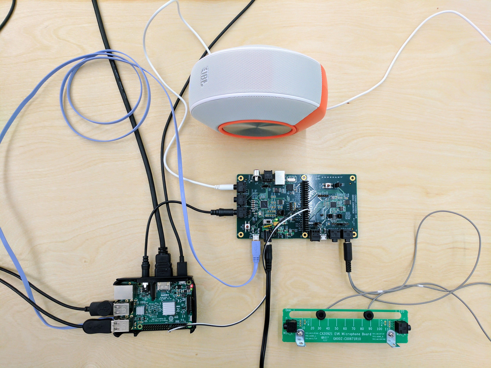

---

## Step 2: Setting up the Raspberry Pi

Next we’ll need to install *Raspbian Jessie* on our Raspberry Pi. The easiest way to do that is by downloading **NOOBS**.

**What is NOOBS**?
NOOBS is an easy operating system installer which contains Raspbian. It also provides a selection of alternative operating systems which are then downloaded from the internet and installed.

#### Downloading NOOBS

**NOTE**: If you have a micro SD card that came with NOOBS pre-installed, make sure it has *Raspbian Jessie* available as one of the install options. If not, follow the steps below to download the latest version of NOOBS.

1. Download the latest NOOBS zip file - [downloads.raspberrypi.org/NOOBS_latest](https://downloads.raspberrypi.org/NOOBS_latest)
2. Format the SD card using [SD Formatter](https://www.raspberrypi.org/documentation/installation/noobs.md)
3. After your SD card has been formatted, drag all the files from the extracted NOOBS folder and drop them onto the SD card.

#### Installing Raspbian Jessie
1. Insert your micro SD card with NOOBS pre-installed into the micro SD card slot on your Pi.
2. Plug in your USB keyboard and mouse.
3. Connect your monitor using the HDMI port.

####  Booting up the Raspberry Pi

1. Plug in the USB power cable to your Pi.
2. Your Pi will boot, and a window will appear with a list of different operating systems that you can install.
3. Tick the box next to **Raspbian** and click on **Install**. Make sure it is Debian Jessie, and not Debian Wheezy.

	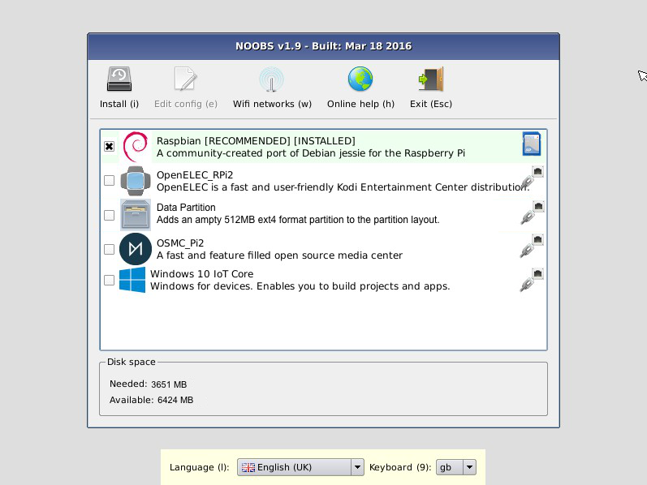

4. Raspbian will run through its installation process.
**Note:** This may take a while - get a cup of coffee (maybe brew a pot -- tea is an acceptable alternative).
5. When the installation is complete, the Raspberry Pi configuration menu (raspi-config) will load. Here you can set the time and date for your region and enable a Raspberry Pi camera board, or even create users. You can exit this menu using Tab on your keyboard to move to **Finish**.
	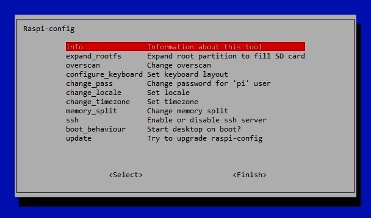
6. Once rebooted, login to your Pi. The default login for Raspbian is username **pi** with the password **raspberry**

**NOTE:** To load the graphical user interface at any time type **startx** into the command line.

More info: [raspberrypi.org](https://www.raspberrypi.org/help/noobs-setup/)

---

#### Using Terminal

**NOTE**: You will be using the **Terminal** utility on your Raspberry Pi to install the utilities you need for this AVS walkthrough. Terminal comes preinstalled on the Raspberry Pi, and you can get to it from the Desktop. You can learn more about Terminal [here](https://www.raspberrypi.org/documentation/usage/terminal/).

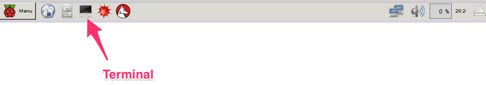

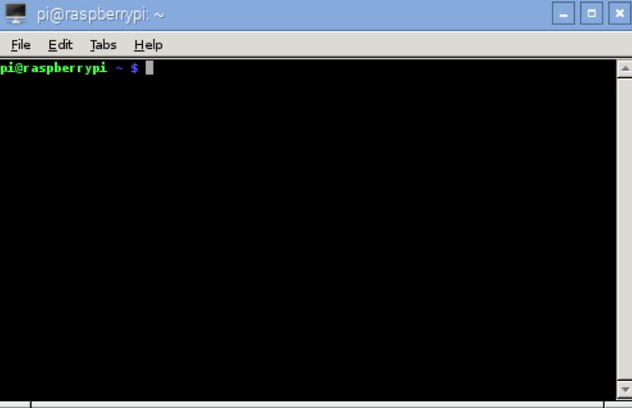

---

### Step 3: Register for an Amazon developer account
Unless you already have one, go ahead and create a free developer account at [developer.amazon.com](https://developer.amazon.com/login.html). You should review the **AVS Terms and Agreements** [here](https://developer.amazon.com/public/solutions/alexa/alexa-voice-service/support/terms-and-agreements).


---

### Step 4: Create a device and security profile
Follow the steps [here](Create-Security-Profile) to register your product and create a security profile.

Make note of the following parameters. You'll need these in [Step 5](Raspberry-Pi#step-5-update-the-install-script-with-your-credentials) below.

* `ProductID` (also referred to as Device Type ID in the Amazon Developer Portal),
* `ClientID`, and
* `ClientSecret`

**Important:** Make sure your **Allowed Origins** and **Allowed Return URLs** are set under **Security Profile > Web Settings** (see [Create a device and security profile](Create-Security-Profile)).

* **Allowed Origins:** https://localhost:3000
* **Allowed Return URLs:** https://localhost:3000/authresponse


---

### Step 5: Clone the sample app

Open **terminal**, and type the following:

	cd Desktop
	git clone https://github.com/alexa/alexa-avs-sample-app.git

---

### Step 6: Update the install script with your credentials

Before running the install script, you'll need to update it with the credentials you got in step 4 - `ProductID`, `ClientID`, `ClientSecret`. Type the following in **terminal**:

	cd ~/Desktop/alexa-avs-sample-app
	nano automated_install.sh

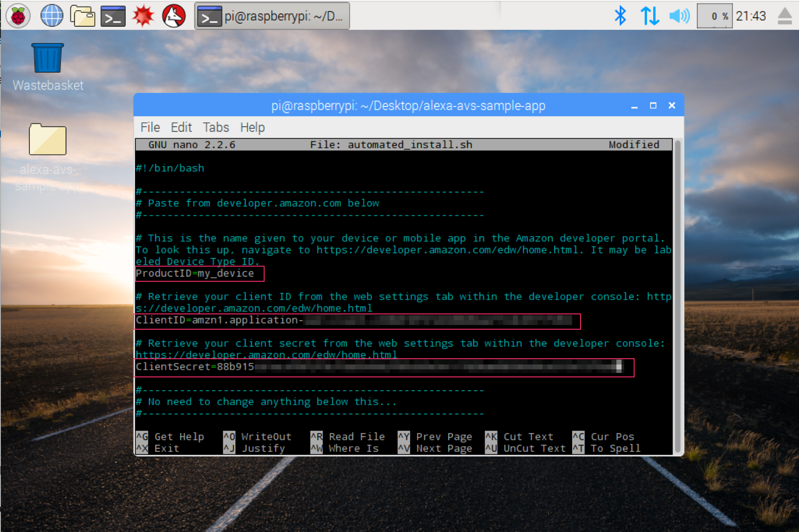

Paste the values for `ProductID`, `ClientID`, and `ClientSecret` that you got in Step 4.

The changes should look like this:

* `ProductID="RaspberryPi3"`
* `ClientID="amzn.xxxxx.xxxxxxxxx"`
* `ClientSecret="4e8cb14xxxxxxxxxxxxxxxxxxxxxxxxxxxxx6b4f9"`

Type **ctrl-X** and then **Y**, and then press Enter to save the changes to the file.

---

### Step 7: Run the automated install script

Now you're ready to run the automated install script. It will install all required dependencies, and wake word engines from Sensory and KITT.AI.

**Note:** The install script will install all project files in the folder that it is executed.

To run the script, open **terminal** and navigate to the folder where the project was cloned. Then run the this command:

	cd ~/Desktop/alexa-avs-sample-app
	chmod +x automated_install.sh
	. automated_install.sh

You'll be prompted to answer a few simple questions. These help to ensure that you've completed all necessary prerequisites before continuing.

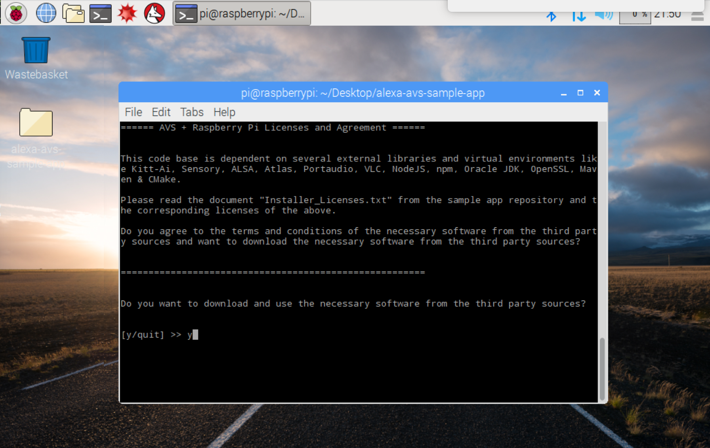

When the wizard starts, go grab another drink - it takes about 30 minutes.

### Step 8: Run your Node.js service, sample app and wake word engine

Now that installation is complete, you'll need to run three commands in **3 separate terminal windows**:

1. **Terminal Window 1**: to run the web service for authorization
2. **Terminal Window 2**: to run the sample app to communicate with AVS
3. **Terminal Window 3**: to run the wake word engine which allows you to start an interaction using the phrase "Alexa".

**Note:** These commands must be run in order.

#### Terminal Window 1
Open a new terminal window and type the following commands to bring up the web service which is used to authorize your sample app with AVS:

	cd ~/Desktop/alexa-avs-sample-app/samples/companionService && npm start

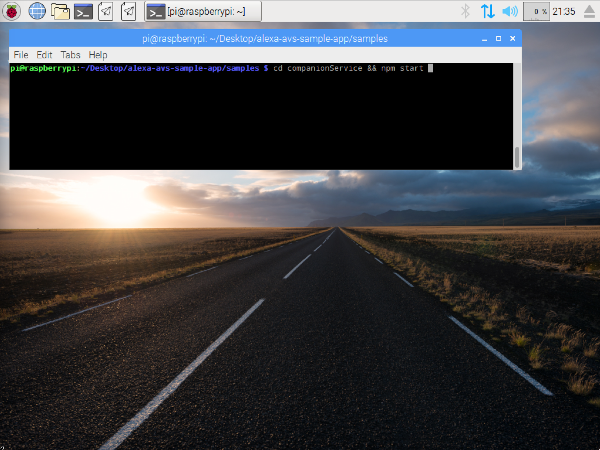


The server is now running on port 3000 and you are ready to start the client.

---

#### Terminal Window 2

Open a new terminal window and type the following commands to run the sample app, which communicates with AVS:

	cd ~/Desktop/alexa-avs-sample-app/samples/javaclient && mvn exec:exec

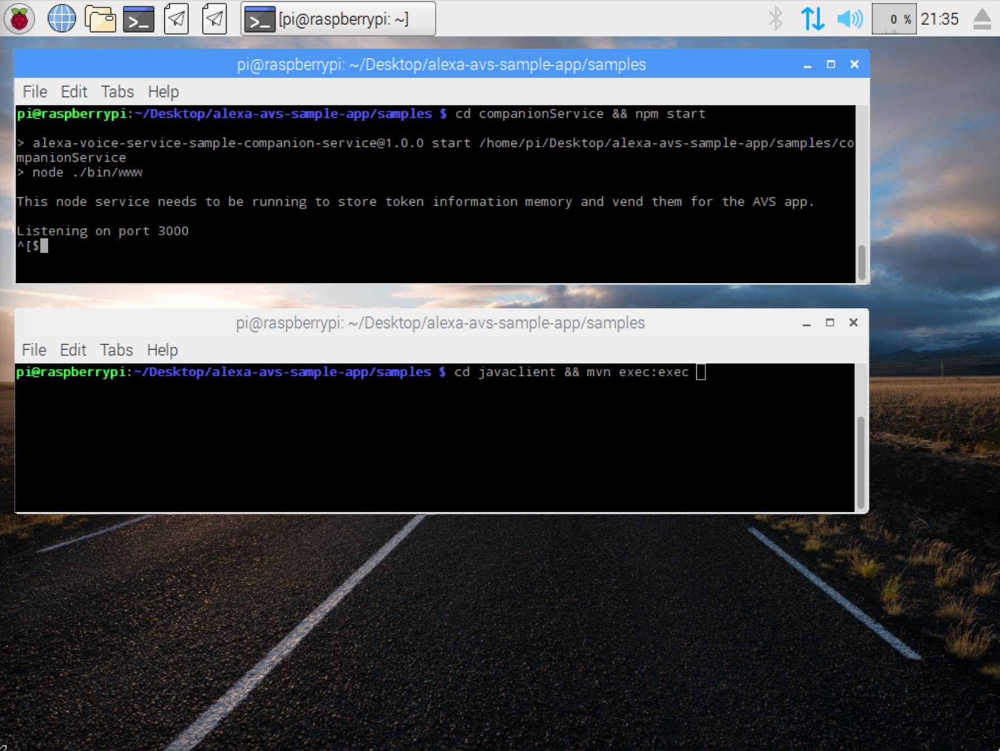

Let's walk through the next few steps relevant to Window 2.

1. A window should pop up with a message that says -

	*Please register your device by visiting the following URL in a web browser and following the instructions: https://localhost:3000/provision/d340f629bd685deeff28a917. Would you like to open the URL automatically in your default browser?*

	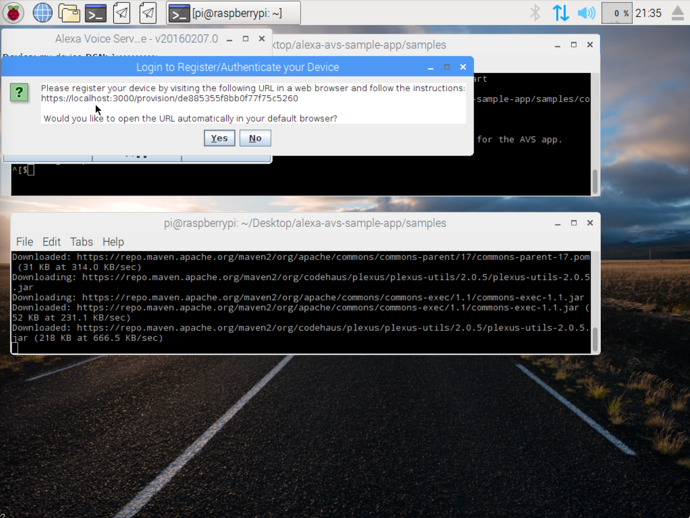

	Click on **"Yes"** to open the URL in your default browser. **IMPORTANT NOTE**: Don't respond to the second pop up until after you've logged in to your Amazon account.

2. If you're running Raspbian Jessie with Pixel desktop (and with Chromium browser), you may get a warning from the browser. You can get around it by clicking on **Advanced -> Proceed to localhost(unsafe)**.

	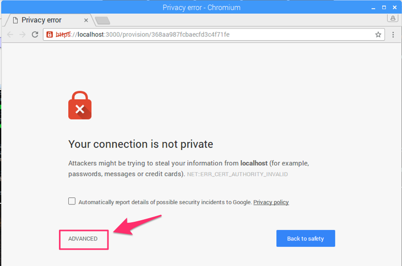
	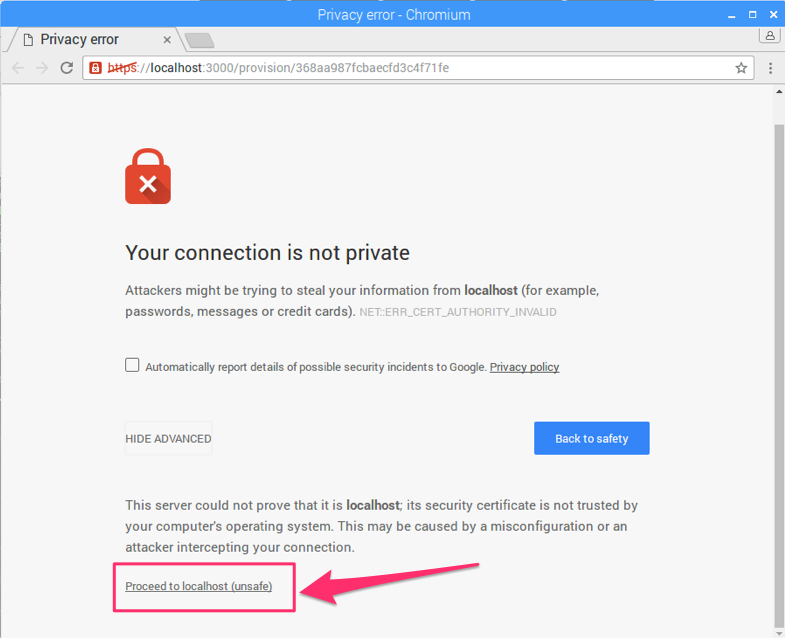

3. You'll be taken to a Login with Amazon web page. Enter your Amazon credentials.

	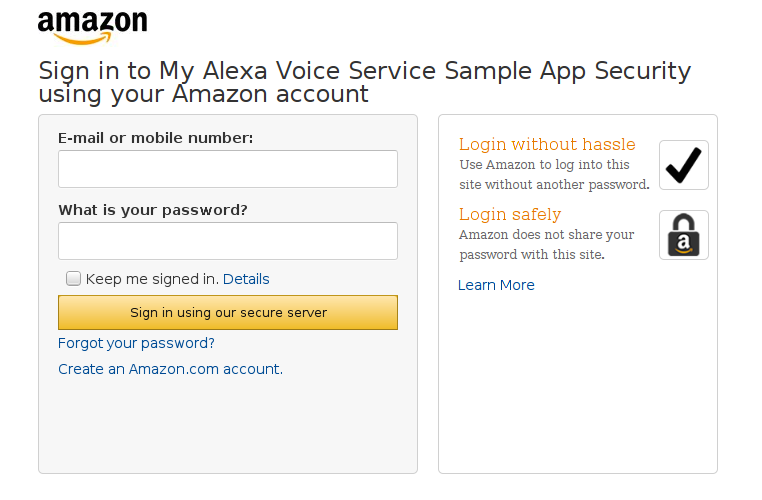

4. You'll be taken to a Dev Authorization page, confirming that you’d like your device to access the Security Profile created earlier.

	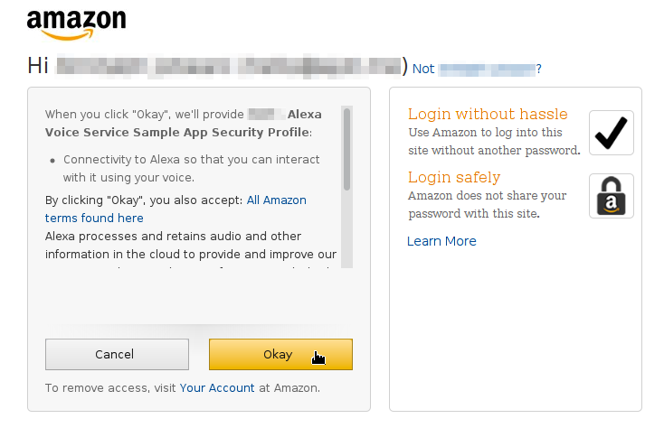

	Click **Okay**.

5. You will now be redirected to a URL beginning with `https://localhost:3000/authresponse` followed by a query string. The body of the web page will say device tokens ready.

	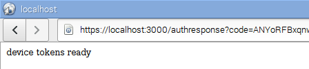

6. Return to the Java application and click the OK button. The client is now ready to accept Alexa requests.

	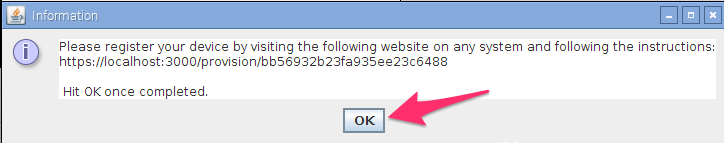

	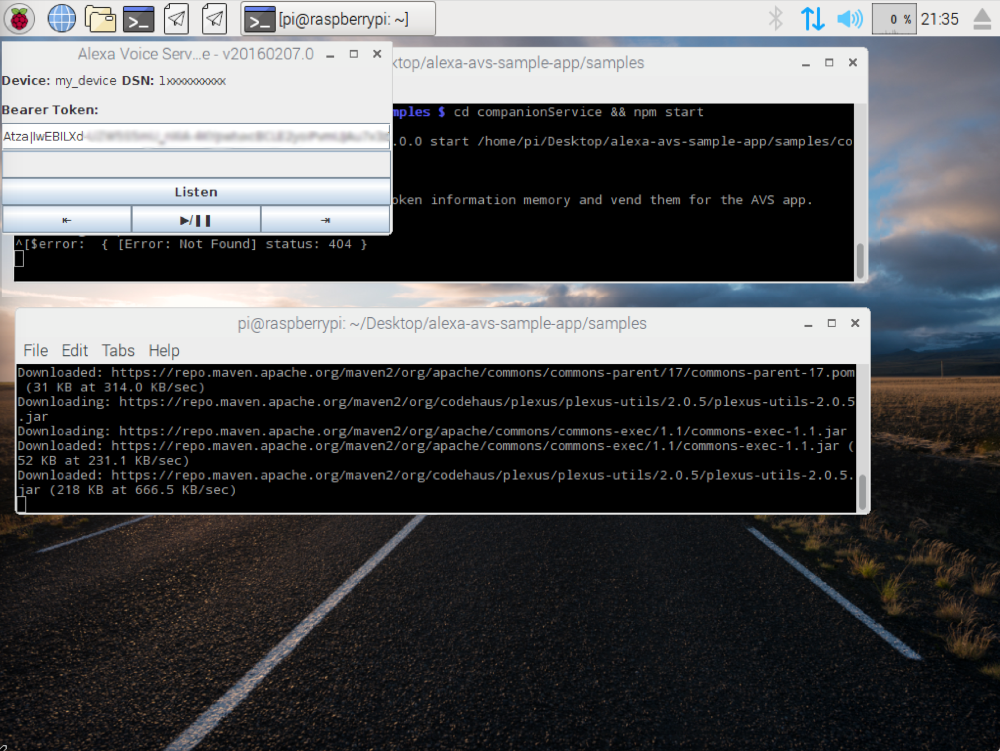

---

#### Terminal Window 3
**Note:** *Skip this step to run the same app without a wake word engine*.

This project supports two versions of Sensory's TrulyHandsFree wake word engine. The `-e` option is used to select the low-power embedded wake word engine running on the Conexant development kit or the high-performance wake word engine running on the Raspberry Pi.

Open a new terminal window and use the following commands to bring up the wake word engine from Sensory. The wake word engine will allow you to initiate interactions using the phrase "Alexa".

To run the embedded low-power **Sensory** wake word engine (on the Conexant CX20921), type -

```
cd ~/Desktop/alexa-avs-sample-app/samples/wakeWordAgent/src
sudo ./wakeWordAgent -e gpio
```

**IMPORTANT NOTE:** You **must** run the wake word agent as admin.

or, to run the high-performance **Sensory** wake word engine (on the Raspberry Pi), type -

	cd ~/Desktop/alexa-avs-sample-app/samples/wakeWordAgent/src && ./wakeWordAgent -e sensory

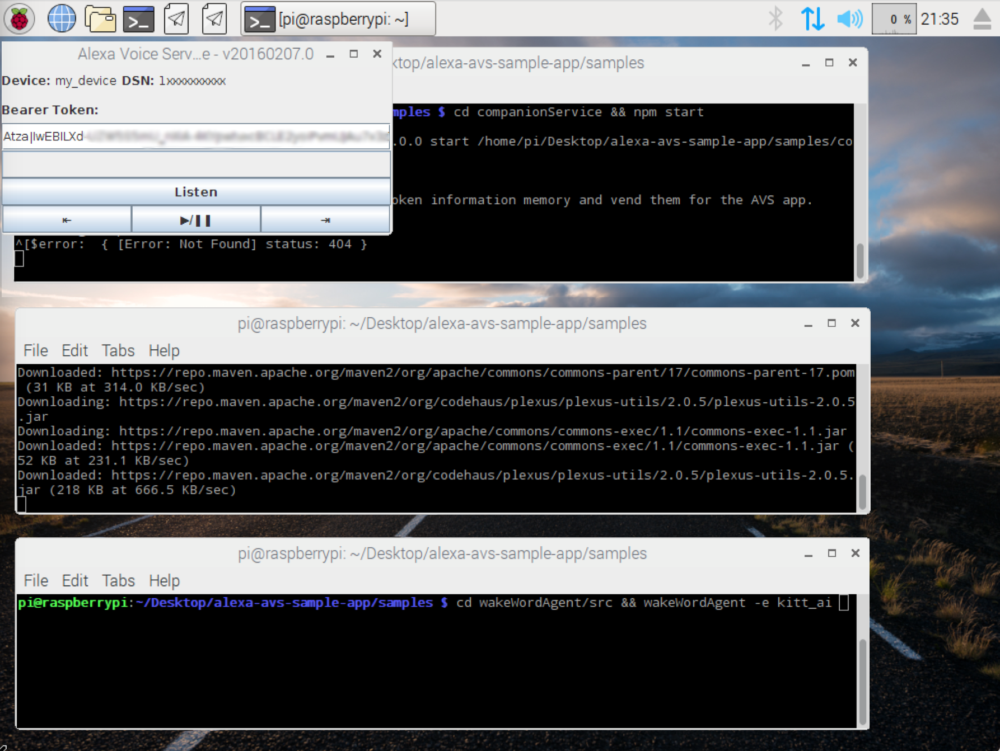

Now you have a working hands-free AVS prototype!

Use the following resources to learn more:

* [Sensory's TrulyHandsFree Wake Word Engine](https://github.com/Sensory/alexa-rpi)
* [Conexant AudioSmart 2-Mic Development Kit for Amazon AVS](http://www.conexant.com/amazon-avs/)


---

### Step 9: Talk to Alexa
You can now talk to Alexa by simply using the wake word "Alexa". Try the following -

* Say "Alexa", then wait for the beep. Now ask "What time is it?"  
* Say "Alexa", then wait for the beep. Now ask "What’s the weather in Las Vegas?"  
* Say "Alexa", then wait for the beep. Now say "Set a timer for 5 seconds."  
* Say "Alexa", then wait for the beep. Now say "Play Z100."  
* Say "Alexa", then wait for the beep. Now say "Good afternoon."  
* Say "Alexa", then wait for the beep. Now say "Tell me a joke?"  
* Say "Alexa", then wait for the beep. Now ask "What’s the meaning of life?"  
* Say "Alexa", then wait for the beep. Now say "Sing happy birthday."  
* Say "Alexa", then wait for the beep. Now ask "What day of the week does Christmas fall on?"  
* Say "Alexa", then wait for the beep. Now ask "Where were you born?"  
* Say "Alexa", then wait for the beep. Now ask "Can you rap?"  

If you prefer, you can also click on the "Listen" button, instead of using the wake word. Click the "Listen" button and wait for the audio cue before beginning to speak. It may take a second or two before you hear the audio cue.
