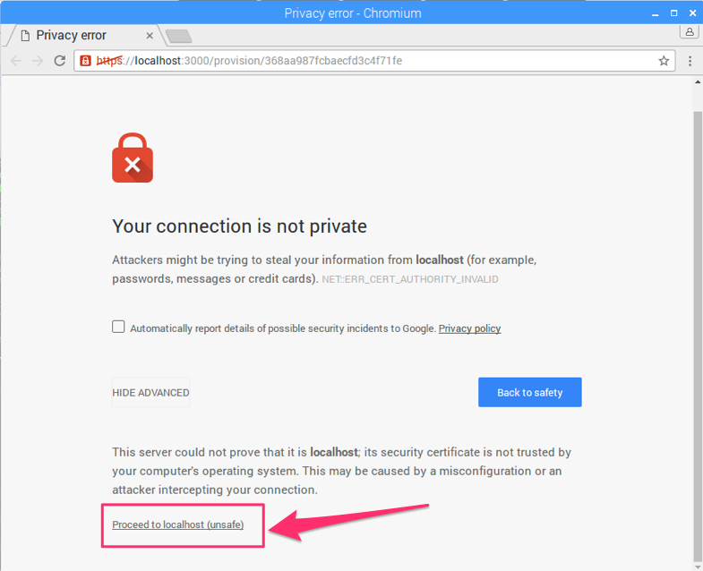
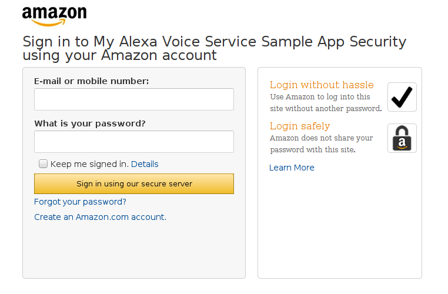
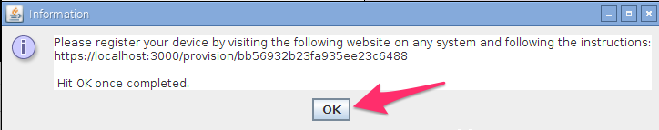

## On this page

* [Overview](#overview)
* [Required Hardware](#required-hardware)
* [Step-by-step Guide](#lets-get-started)
* [Extra Credit (Setup SSH & VNC)](#step-9-optional-go-headless-and-get-rid-of-the-monitor-keyboard-and-mouse)

---

## Overview

This guide provides step-by-step instructions for setting up AVS on a **Raspberry Pi**. It demonstrates how to access and test AVS using our Java sample app (running on a Raspberry Pi), a Node.js server, and a third-party wake word engine. You will use the Node.js server to obtain a Login with Amazon (LWA) authorization code by visiting a website using your Raspberry Pi's web browser.

For instructions on how to set it up on [Mac](Mac), [Linux](Linux) or [Windows](Windows), please see our [wiki]().

---

## Required hardware

Before you get started, let's review what you'll need.

1. **Raspberry Pi 3** (Recommended) or **Pi 2 Model B** (Supported)  - Buy at Amazon - [Pi 3](https://amzn.com/B01CD5VC92) or [Pi 2](http://amzn.com/B00T2U7R7I).
2. **Micro-USB power cable** for Raspberry Pi.
3. **Micro SD Card** (Minimum 8 GB) - You need an operating system to get started. NOOBS (New Out of the Box Software) is an easy-to-use operating system install manager for Raspberry Pi. The simplest way to get NOOBS is to buy an SD card with NOOBS pre-installed - [Raspberry Pi 8GB Preloaded (NOOBS) Micro SD Card](https://www.amazon.com/gp/product/B00ENPQ1GK/ref=oh_aui_detailpage_o01_s00?ie=UTF8&psc=1). Alternatively, you can download and install it on your SD card (follow instructions [here](#step-1-setting-up-your-pi)).
4. **USB 2.0 Mini Microphone** - Raspberry Pi does not have a built-in microphone; to interact with Alexa you'll need an external one to plug in - [Buy on Amazon](http://amzn.com/B00IR8R7WQ)
5. **External Speaker** with 3.5mm audio cable - [Buy on Amazon](http://amzn.com/B007OYAVLI)
6. A **USB Keyboard & Mouse**, and an external **HDMI Monitor** - we also recommend having a USB keyboard and mouse as well as an HDMI monitor handy if you're unable to [remote(SSH)](Setup-SSH-&-VNC) into your Pi.
7. Internet connection (Ethernet or WiFi)
8. (Optional) WiFi Wireless Adapter for Pi 2 ([Buy on Amazon](http://www.amazon.com/CanaKit-Raspberry-Wireless-Adapter-Dongle/dp/B00GFAN498/)).
   **Note:** Pi 3 has built-in WiFi.

For extra credit, we'll show you how to [remote(SSH)](Setup-SSH-&-VNC) into your device, eliminating the need for a monitor, keyboard and mouse - and how to tail logs for troubleshooting.

---

## Let's get started
The original Alexa on a Pi project required manual download of libraries/dependencies and updating a series of configuration files that were prone to human error. To make the process faster and easier, we’ve included an install script with the project that will take care of all the heavy lifting. Not only does this reduce setup time to less than an hour on a Raspberry Pi 3, it only requires developers to adjust three variables in a single install script -

### Step 1: Setting up your Pi

Unless you already have Raspbian Jessie installed on your Pi, please follow our guide - [Setting up the Raspberry Pi](Setting-up-the-Raspberry-Pi) - that will walk you through downloading and installing Raspbian Jessie, and connecting the hardware (if you're unfamiliar with Raspberry Pi, we **highly recommend** you follow the guide above to get your Pi up and ready before moving further).

### Step 2: Register for an Amazon developer account
Unless you already have one, go ahead and create a free developer account at [developer.amazon.com](https://developer.amazon.com/login.html). You should review the **AVS Terms and Agreements** [here](https://developer.amazon.com/public/solutions/alexa/alexa-voice-service/support/terms-and-agreements).

---

### Step 3: Create a device and security profile
Follow the steps [here](Create-Security-Profile) to register your product and create a security profile.

Make note of the following parameters. You'll need these in [Step 5](Raspberry-Pi#step-5-update-the-install-script-with-your-credentials) below.

* `ProductID` (also known as Device Type ID),
* `ClientID`, and
* `ClientSecret`

**Important:** Make sure your **Allowed Origins** and **Allowed Return URLs** are set under **Security Profile > Web Settings** (see [Create a device and security profile](Create-Security-Profile)):

* **Allowed Origins:** https://localhost:3000  
* **Allowed Return URLs:** https://localhost:3000/authresponse

---

### Step 4: Clone the sample app

Open **terminal**, and type the following:

	cd Desktop
	git clone https://github.com/alexa/alexa-avs-sample-app.git

---

### Step 5: Update the install script with your credentials

Before you run the install script, you need to update the script with the credentials that you got in step 3 - `ProductID`, `ClientID`, `ClientSecret`. Type the following in **terminal**:

	cd ~/Desktop/alexa-avs-sample-app
	nano automated_install.sh

Paste the values for `ProductID`, `ClientID`, and `ClientSecret` that you got from Step 3 above.

The changes should look like this:

* `ProductID="RaspberryPi3"`    
* `ClientID="amzn.xxxxx.xxxxxxxxx"`    
* `ClientSecret="4e8cb14xxxxxxxxxxxxxxxxxxxxxxxxxxxxx6b4f9"`  

Type **ctrl-X** and then **Y**, and then press Enter to save the changes to the file.

---

### Step 6: Run the install script

You are now ready to run the install script. This will install all dependencies, including the two wake word engines from Sensory and KITT.AI.

**Note:** The install script will install all project files in the folder that the script is run from.

To run the script, open **terminal** and navigate to the folder where the project was cloned. Then run the following command:

	cd ~/Desktop/alexa-avs-sample-app
	. automated_install.sh

You'll be prompted to answer a few simple questions. These help to ensure that you've completed all necessary prerequisites before continuing.

When the wizard starts, go grab a cup of coffee - it takes about 30 minutes.

### Step 7: Run your web service, sample app and wake word engine

Now that installation is complete, you'll need to run three commands in **3 separate terminal windows**:

1. **Terminal Window 1**: to run the web service for authorization
2. **Terminal Window 2**: to run the sample app to communicate with AVS
3. **Terminal Window 3**: to run the wake word engine which allows you to start an interaction using the phrase "Alexa".

**Note:** These commands must be run in order.

#### Terminal Window 1
Open a new terminal window and type the following commands to bring up the web service which is used to authorize your sample app with AVS:

	cd ~/Desktop/alexa-avs-sample-app/samples
	cd companionService && npm start

The server is now running on port 3000 and you are ready to start the client.		

See [API Overview > Authorization](https://developer.amazon.com/public/solutions/alexa/alexa-voice-service/content/avs-api-overview#authorization) to learn more about authorization.

---

#### Terminal Window 2

Open a new terminal window and type the following commands to run the sample app, which communicates with AVS:

	cd ~/Desktop/alexa-avs-sample-app/samples
	cd javaclient && mvn exec:exec

			 

See [API Overview > Interfaces](https://developer.amazon.com/public/solutions/alexa/alexa-voice-service/content/avs-api-overview#interfaces) to learn more about the messages sent to/from AVS.

Let's walk through the next few steps relevant to Window 2.

1. When you run the client, a window should pop up with a message that says -

	*Please register your device by visiting the following URL in a web browser and following the instructions: https://localhost:3000/provision/d340f629bd685deeff28a917. Would you like to open the URL automatically in your default browser?*

	

	Click on **"Yes"** to open the URL in your default browser.

2. If you're running Raspbian Jessie with Pixel desktop (and with Chromium browser), you may get a warning from the browser. You can get around it by clicking on **Advanced -> Proceed to localhost(unsafe)**.

	
	

3. You'll be taken to a Login with Amazon web page. Enter your Amazon credentials.

	

4. You'll be taken to a Dev Authorization page, confirming that you’d like your device to access the Security Profile created earlier.

	

	Click **Okay**.

5. You will now be redirected to a URL beginning with `https://localhost:3000/authresponse` followed by a query string. The body of the web page will say device tokens ready.

	

6. Return to the Java application and click the OK button. The client is now ready to accept Alexa requests.

	

	

---

#### Terminal Window 3
**Note:** *Skip this step to run the same app without a wake word engine*.

This project supports two third-party wake word engines: Sensory's TrulyHandsFree and KITT.AI's Snowboy. The `-e` parameter is used to select the agent and supports two values for {{engine}}: `kitt_ai` and `sensory`.

Open a new terminal window and use the following commands to bring up a wake word engine from Sensory or KITT.AI. The wake word engine will allow you to initiate interactions using the phrase "Alexa".

To use the **Sensory** wake word engine, type -

	cd ~/Desktop/alexa-avs-sample-app/samples
	cd wakeWordAgent/src && ./wakeWordAgent -e sensory

or, type this to use **KITT.AI**'s wake word engine -

	cd ~/Desktop/alexa-avs-sample-app/samples
	cd wakeWordAgent/src && ./wakeWordAgent -e kitt_ai

Now you have a working hands-free AVS prototype!

Use the following resources to learn more about available wake word engines:

* [Sensory](https://github.com/Sensory/alexa-rpi)
* [KITT.AI](https://github.com/Kitt-AI/snowboy)

---

### Step 8: Talk to Alexa
You can now talk to Alexa by simply using the wake word "Alexa". Try the following -

Say "Alexa", then wait for the beep. Now say "what's the time?"

Say "Alexa", then wait for the beep. Now say "what's the weather in Seattle?"

If you prefer, you can also click on the "Listen" button, instead of using the wake word. Click the "Listen" button and wait for the audio cue before beginning to speak. It may take a second or two before you hear the audio cue.

---

### Step 9: (Optional): Go headless and get rid of the monitor, keyboard, and mouse

Now that you've got your AVS prototype running, you may want to get rid of the monitor, keyboard and mouse. You can do that by using SSH and VNC. Follow the instructions to [setup SSH and VNC](Setup-SSH-&-VNC).
