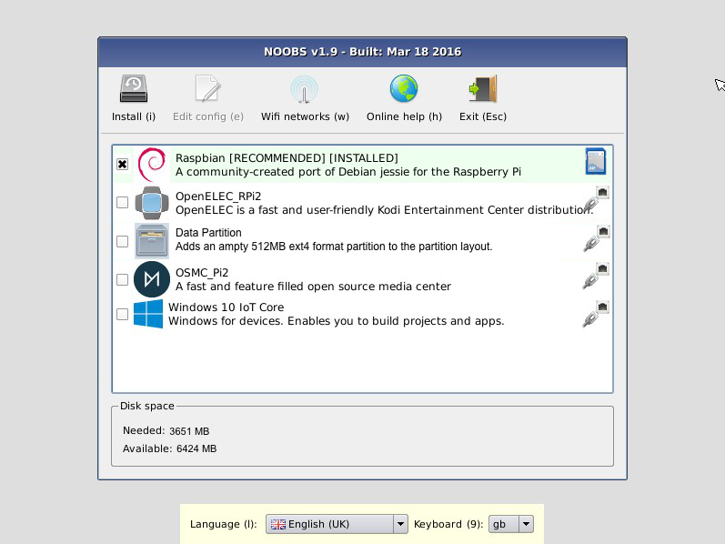
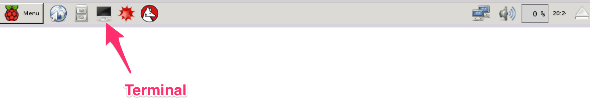

## Setting up the Raspberry Pi

1. Downloading NOOBS
2. Installing Raspbian Jessie
3. Booting up the Raspberry Pi
4. Using Terminal

---

The first thing we’ll need to do is install *Raspbian Jessie* on our Pi. The easiest way to do that is by downloading **NOOBS**.

**What is NOOBS**?  
NOOBS is an easy operating system installer which contains Raspbian. It also provides a selection of alternative operating systems which are then downloaded from the internet and installed.

**NOTE:** If you already have Raspbian Jessie installed on your Pi, you may skip to [*Step 2 - Installing utilities - SSH, VNC Server, VLC, Node*](#2---installing-utilities---ssh-vnc-server-vlc-node) below.

---

### 1 - Downloading NOOBS

**NOTE**: If you have a micro SD card that came with NOOBS pre-installed, make sure it has *Raspbian Jessie* available as one of the install options. If not, follow the steps below to download the latest version of NOOBS.

1. Download the latest NOOBS zip file - [downloads.raspberrypi.org/NOOBS_latest](https://downloads.raspberrypi.org/NOOBS_latest)
2. Format the SD card using [SD Formatter](https://www.raspberrypi.org/documentation/installation/noobs.md)
3. Drag and drop NOOBS files on to the SD Card: Once your SD card has been formatted, drag all the files from the extracted NOOBS folder and drop them onto the SD card drive.

### 2 - Installing Raspbian Jessie
1. Insert your micro SD card with NOOBS pre-installed into the micro SD card slot on your Pi.

2. Plug in the USB 2.0 Mini Microphone, and the (optional) WiFi Wireless Adapter.
3. Plug in your USB keyboard and mouse.
4. Connect your monitor using the HDMI port.

---

##  3 - Booting up the Raspberry Pi

1. Now plug in the USB power cable to your Pi.
2. Your Pi will boot, and a window will appear with a list of different operating systems that you can install.
3. Tick the box next to **Raspbian** and click on **Install**. Make sure it is Debian Jessie, and not Debian Wheezy.

	

4. Raspbian will run through its installation process.   
**Note:** This may take a while - get a cup of coffee (maybe brew a pot).
5. When the installation process is complete, the Raspberry Pi configuration menu (raspi-config) will load. Here you can set the time and date for your region and enable a Raspberry Pi camera board, or even create users. You can exit this menu using Tab on your keyboard to move to **Finish**.
	
6. Once rebooted, login to your Pi. The default login for Raspbian is username **pi** with the password **raspberry**

**NOTE:** To load the graphical user interface at any time type **startx** into the command line.

More info: [raspberrypi.org](https://www.raspberrypi.org/help/noobs-setup/)

---

## 4 - Using Terminal

**NOTE**: You will be using the **Terminal** utility on your Raspberry Pi to install the utilities you need for this AVS walkthrough. Terminal comes preinstalled on the Raspberry Pi, and you can get to it from the Desktop. You can learn more about Terminal [here](https://www.raspberrypi.org/documentation/usage/terminal/).

