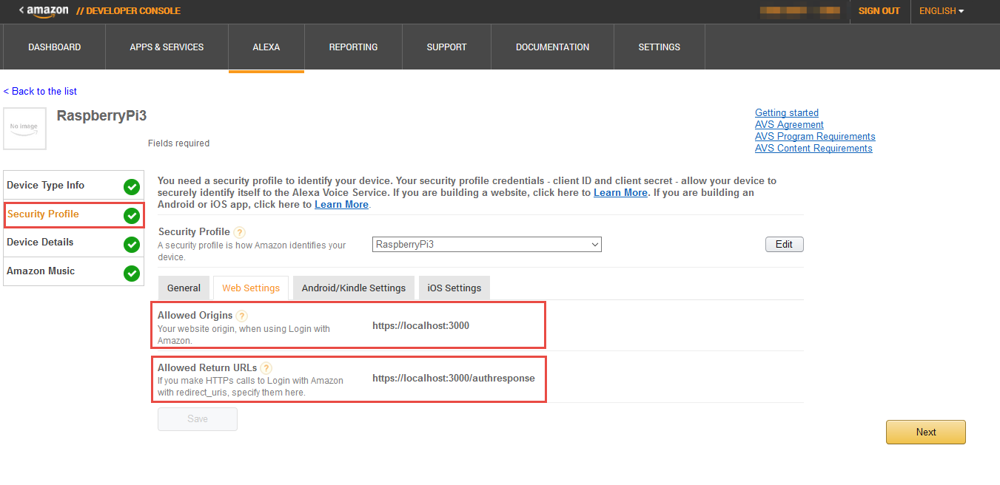

## On this page

1. [Prerequisites](#1---prerequisites)
2. [Clone the Sample App](#2---clone-the-sample-app)
3. [Install Dependencies](#3---install-dependencies)
4. [Generate Self-signed Certificates](#4---generating-self-signed-certificates)
5. [Choose your authentication method](#5---choose-your-authentication-method) - [Node](#5a---build-and-run-a-nodejs-server-authentication)/[Android](#5b---build-and-run-an-android-companion-app-authentication)/[iOS](#5c---build-and-run-an-ios-companion-app-for-authentication)
6. [Run the Sample App](#6---run-the-sample-app)
7. [Talk to Alexa](#7---talk-to-alexa)

---

## Overview

The following instructions will walk you through cloning (or downloading) the sample app and downloading dependencies on **Windows**. You can also set this up on a [Raspberry Pi](Raspberry-Pi), [Mac](Mac), or [Linux](Linux).

---

## Terms of Service
By using the sample app and its dependencies, you agree to the [AVS Terms and Agreements](https://developer.amazon.com/public/solutions/alexa/alexa-voice-service/support/terms-and-agreements).

---

## 1 - Prerequisites

### a. Register for an Amazon developer account

Unless you already have one, go ahead and create a free developer account at [developer.amazon.com](https://developer.amazon.com/login.html). You should review the **AVS Terms and Agreements** [here](https://developer.amazon.com/public/solutions/alexa/alexa-voice-service/support/terms-and-agreements).

### b. Create a device and security profile
Follow the steps [here](Create-Security-Profile) to register your product and create a security profile.

Make note of the following parameters. You'll need these in a minute or two.

* `ProductID` (also known as Device Type ID),
* `ClientID`, and
* `ClientSecret`

**Important:** Make sure your **Allowed Origins** and **Allowed Return URLs** are set under **Security Profile > Web Settings** (see [Create a device and security profile](Create-Security-Profile)):

* **Allowed Origins:** https://localhost:3000  
* **Allowed Return URLs:** https://localhost:3000/authresponse

---

## 2 - Clone the Sample App

1. Clone the sample app into the directory of your choosing. Open command prompt, navigate to the appropriate directory and type the following:  

    git clone https://github.com/alexa/alexa-avs-sample-app.git

   Further instructions will reference this location as {REFERENCE_IMPLEMENTATION}.  

   If you're not familiar with Git or you prefer to [download a zip click here](https://github.com/alexa/alexa-avs-sample-app/archive/master.zip).

## 3 - Install dependencies

1. Download [VLC media player here](http://www.videolan.org/). The architecture (32 or 64-bit) of the VLC media player must match the architecture of the Java Developement Kit (JDK) you have installed (or will install later in these instructions).
2. After you've installed VLC, set the following environment variables:
   * **VLC_PATH**: point this to the VLC installation without using whitespace.
     For example, if the path to your VLC installation is `C:\Program Files\VideoLAN\VLC`, the environment variable to set is `C:\Progra~1\VideoLAN\VLC`.
   * To set an environment variable in Windows, follow these steps:
     1. Go to Control Panel.
     2. Go to System.
     3. Select "Advanced system settings."
     4. Select the "Environment Variables..." button near the bottom.
     5. Under "System variables" click New...
     6. Set the values:
        * Variable name: `VLC_PATH`
        * Variable value: `C:\Progra~1\VideoLAN\VLC`
     7. Close system settings pane.       
3. Download and install [Node.js](https://nodejs.org/download).
4. Ensure you have JDK version 8 installed. If JDK is not installed or you need to update from a previous version, [you can download version 8 here](http://www.oracle.com/technetwork/java/javase/downloads/jdk8-downloads-2133151.html).
   **Note:** As mentioned earlier, please ensure that your JDK's architecture matches the architecture for VLC (Step 3).
5. Download [Maven](https://maven.apache.org/download.cgi) and follow the instructions for [Installing Apache Maven](https://maven.apache.org/install.html).
6. If you plan to authenticate using an Android companion app, download [Android Studio](). If you plan to authenticate using an iOS companion app, download [Xcode 7 for Mac from the Mac App Store](https://developer.apple.com/xcode/download/).

---

## 4 - Generating Self Signed Certificates

1. Download and install [OpenSSL](http://slproweb.com/products/Win32OpenSSL.html).
2. Add the OpenSSL `bin` folder to the Windows PATH (see environment variables).
3. Edit the `ssl.cnf` configuration file with your favorite text editor. Replace any placeholder values that start with `YOUR_`.  
   **Note:** `countryName` must be two characters (e.g. US). If it is not two characters, certificate creation will fail. Additionally, if you will be accessing your device from any IP or DNS entry besides localhost (127.0.0.1 or 10.0.2.2), you must add the additional IP or or DNS entries to `[alt_names]`. One situation where you will need to add entries to `[alt_names]` is if you are going to authenticate using an Android or iOS companion app from a device instead of from the Android or iOS emulators on the same machine as the Node.js server and sample app.
4. Open a command prompt.
5. Change directories to `{REFERENCE_IMPLEMENTATION}\samples\javaclient`.
6. Type: `set OPENSSL_CONF={OpenSSL installation location}\bin\openssl.cfg`.
7. Run the certificate generation script: `generate.bat`.
8. During generation you will be prompted for some information (save this information -- you'll need it later):
   * When prompted for a `productID`, enter the `productID` (or Device Type ID) listed under "Device Type Info" in the [Amazon developer portal](https://developer.amazon.com/edw/home.html#/).
   * When prompted for a `serial number`, enter your product's serial number. For prototyping purposes we recommend using: 123456.
   * When prompted for a `password`, create a password (just don't forget it -- you'll need this soon). For prototyping purposes we recommend leaving password blank.
9. Edit the configuration file for the Node.js server. The configuration file is located in `{REFERENCE_IMPLEMENTATION}\samples\companionService\config.js`.
   * Set `sslKey` to `{REFERENCE_IMPLEMENTATION}\\samples\\javaclient\\certs\\server\\node.key`.
   * Set `sslCert` to `{REFERENCE_IMPLEMENTATION}\\samples\\javaclient\\certs\\server\\node.crt`.
   * Set `sslCaCert` to `{REFERENCE_IMPLEMENTATION}\\samples\\javaclient\\certs\\ca\\ca.crt`.
10. Edit the configuration file for the sample app. The configuration file is located at `{REFERENCE_IMPLEMENTATION}\samples\javaclient\config.json`.
    * Set `companionApp.sslKeyStore` to `{REFERENCE_IMPLEMENTATION}\\samples\\javaclient\\certs\\server\\jetty.pkcs12`.
    * Set `companionApp.sslKeyStorePassphrase` to the password entered in the certificate generation script.
    * Set `companionService.sslClientKeyStore` to `{REFERENCE_IMPLEMENTATION}\\samples\\javaclient\\certs\\client\\client.pkcs12`.
    * Set `companionService.sslClientKeyStorePassphrase` to the password entered in the certificate generation script.
    * Set `companionService.sslCaCert` to `{REFERENCE_IMPLEMENTATION}\\samples\\javaclient\\certs\\ca\\ca.crt`.

---

## 5 - Choose your authentication method
You should now decide if you want your users to authenticate using a website or mobile app. You can only authenticate using one of the following methods at a given time:

* [Build and Run a Node.js Server Authentication](#5a---build-and-run-a-nodejs-server-authentication), **or**
* [Build and Run an Android Companion App Authentication](#5b---build-and-run-an-android-companion-app-authentication), **or**
* [Build and Run an iOS Companion App for Authentication](#5c---build-and-run-an-ios-companion-app-for-authentication)

**IMPORTANT:** Only one method can be used at a time. If you want to test authentication using a web site __and__ a mobile companion app (iOS or Android), you can do so by testing the first provisioning method, then [clearing your access token](Clearing-Your-Access-Tokens) and switching to the other provisioning method. For instructions see [Clearing Your Access Token to Change Provisioning Methods](Clearing-Your-Access-Tokens).

### 5a - Build and Run a Node.js Server Authentication

The following instructions will walk you through building and running the Node.js server for authentication. Looking to authenticate using a mobile app instead? See instructions for [Android](#5b---build-and-run-an-android-companion-app-authentication), and [iOS](#5c---build-and-run-an-ios-companion-app-for-authentication).

**NOTE:** The server implementation does not use persistent storage; everything is stored in memory. Therefore, if you shut down the server, you will lose your tokens.

To run the server, follow these instructions:

1. Open a command prompt.
2. Change directories to `{REFERENCE_IMPLEMENTATION}/samples/companionService`
3. To install dependencies, type: `npm install`.
4. In a web browser, visit the [Login with Amazon developer portal](https://developer.amazon.com/lwa/sp/overview.html).
5. Near the top of the page, select your security profile from the drop down menu and click **Confirm**.
6. Enter a privacy policy URL beginning with `http://` or `https://`. For this example, you can enter a fake URL such as `http://example.com`. Optionally, you can choose to upload an image, which will be shown on the Login with Amazon consent page. Click **Save**.
7. Next to **Security Profile**, click **Show Client ID and Client Secret**. This will display your client ID and client secret. Save these values.
8. In your favorite text editor, open `{REFERENCE_IMPLEMENTATION}/samples/companionService/config.js` and edit the following values:
   * `clientId`: Paste in your client ID as a string.
   * `clientSecret`: Paste in your client secret as a string.
   * `products`: The products object consists of a key that should be the same as the product ID (also referred to as **Device Type ID**) that you set up in the developer portal and an array of unique product identifiers. For this project, the array should be a single value, and match the serial number you entered while [generating certificates]().
9. Save the `config.js`.
10. From your command prompt, run the following: `npm start`.

The server is running. You are now ready to run the sample app. Skip to - "[6 - Run the sample app](#6---run-the-sample-app)".

### 5b - Build and Run an Android Companion App Authentication

To build and run the Android companion app, follow these instructions:

1. Generate a `keystore` to sign your app.
   * Open a command prompt.
   * Change directories to `{REFERENCE_IMPLEMENTATION}/samples/androidCompanionApp/app/``
   * On Windows, ensure the JDK bin folder (typically `C:\Program Files\Java\jdkXXX\bin` where XXX is the version of the JDK) is part of your PATH (see [environment variables]()).
   * Enter the following command: `keytool -genkey -v -keystore keystore.jks -alias androiddebugkey -keyalg RSA -sigalg SHA1withRSA -keysize 2048 -validity 10000`. You will be prompted to enter a password. Enter **android**. You will then be prompted to enter some information about yourself. After you've entered your personal information, you will be prompted for another password. Press Return to use **android** again.
2. Get your Android app signature. In the same command prompt window, enter the following command: `keytool -list -v -alias androiddebugkey -keystore keystore.jks`. You will be prompted for a password. Enter **android**. When the `keytool` command returns, save the **MD5 certificate fingerprint**.
3. Log in to the [Amazon developer portal](https://developer.amazon.com/login.html).
4. In the top navigation, click **Alexa** then select **Alexa Voice Service**. Find your project, and click **Edit**, then navigate to the **Security Profile** tab.
5. From the drop down, select the security profile you created in [Getting Started]().
6. Click the **Android/Kindle Settings** tab.
7. Enter the following information:  
   * **API Key Name:** "Alexa Voice Service Test Android App"
   * **Package:** com.amazon.alexa.avs.companion
   * **Signature:** The MD5 fingerprint you saved in step 2.
8. Click **Add an API Key**.
9. Copy the generated key into a text file and save it as `{REFERENCE_IMPLEMENTATION}/samples/androidCompanionApp/app/src/main/assets/api_key.txt`. You will need to create the **assets** folder.  
**Note:** Be mindful of whitespace in the path.
10. Open Android Studio.
    * In the **Welcome to Android Studio** window, choose **Open an existing Android Studio project**.
    * In the file chooser, select `{REFERENCE_IMPLEMENTATION}/samples/androidCompanionApp`.
    * The project should open. If you get an error that says failed to find target with hash string `android-22`, it means you need to load the Android API level 22 SDK. Click the link that says **Open Android SDK Manager** to open the SDK manager. Click the link that says **Deselect All**. Expand **Android 5.1.1 (API 22)** and select **SDK Platform**. Install that package, accepting any necessary license agreements. Once the SDK has installed, close and reopen the project. You will get another error that says failed to find Build Tools revision 22.0.1. Click the link to **Install Build Tools 22.0.1** and sync project. Now the project should open.
11. Run the Android companion app.  
    * Click the green right-pointing **play** triangle in the Android Studio task bar at the top of the Android Studio window.
    * In the device chooser window, select one of the emulators, then click **OK**.

You are now ready to run the sample app. Skip to - "[6 - Run the sample app](#6---run-the-sample-app)".

### 5c - Build and Run an iOS Companion App for Authentication

To see an example of how to obtain a Login with Amazon authorization code from an iOS app, build and run the iOS sample project.

To build and run the iOS mobile app, follow these instructions:

1. Open the iOS sample app in Xcode 7. To do this, double click `{REFERENCE_IMPLEMENTATION}/samples/iOSCompanionApp/AlexaCompanionAppSample.xcodeproj`
2. [Log in to the Amazon developer portal](https://developer.amazon.com/login.html).
3. In the top navigation, click **Alexa** then select **Alexa Voice Service**. Find your project, and click **Edit**, then navigate to the **Security Profile** tab.
4. From the drop down, select the security profile you created in [Getting Started]().
5. Click the **iOS Settings** tab.
6. Enter the following information:
   * **API Key Name:** "Alexa Voice Service test iOS app"
   * **Bundle ID:** com.amazon.AlexaCompanionAppSample
7. Click **Add an API Key**
8. Copy the key to your computer's clipboard.
9. Add the API key to the Xcode project.
   * In the Xcode project, make sure the left navigation pane is set to the project navigator by clicking the left-most icon that looks like a file folder at the top of the navigation pane.
   * Expand *AlexaCompanionAppSample → Application → Supporting Files*, then select `AlexaCompanionAppSample-Info.plist`.
   * In the middle editing pane, make sure none of the entries are selected.
   * In the menu bar, select *Editor → Add Item*.
   * In the combo drop down that appears, type `APIKey` and press return.
   * Double click within the **Value** column and paste the API key that you copied in step 8. Make sure there is no extra whitespace before and after the value, then press **return**.
10. Build and run the app in the simulator by clicking the black right-pointing **play** button at the top left of the Xcode window.

You are now ready to run the sample app. Skip to - "[6 - Run the sample app](#6---run-the-sample-app)".

---

## 6 - Run the sample app

Now that you've set up your companion site (server)/companion app for authentication you're ready to run the sample app.

1. In your favorite text editor, open `{REFERENCE_IMPLEMENTATION}/samples/javaclient/config.json` and edit the following values:

    `productId`: Enter my_device as a string.
    `dsn`: Enter the same alphanumeric string that you entered for the unique product identifier in the products object in the server's config.js as a string. For example, use 123456.
    `provisioningMethod`: If you want to use either the Android or iOS sample app, enter companionApp. Otherwise, enter companionService.

2. Save the config.json.
3. In that same text editor, open `{REFERENCE_IMPLEMENTATION}/samples/javaclient/pom.xml` and locate `{alpn-boot.version}xxx{/alpn-boot.version}`. Confirm that the ALPN version matches your JDK version using the table located [here]http://www.eclipse.org/jetty/documentation/current/alpn-chapter.html#alpn-versions). If the versions match no further action is necessary. If the versions do not match, update the `pom.xml` file with the correct ALPN version.
4. Open a command prompt.
5. Change directories to `{REFERENCE_IMPLEMENTATION}/samples/javaclient`
6. Run `mvn validate` to ensure the project is correct and that all necessary information is available.
7. Run `mvn install` to download dependencies and build the sample app.
8. Run `mvn exec:exec` to run the sample app.
9. Depending on whether you specified `companionApp` or `companionService` as the `provisioningMethod` in the `config.json`, follow the instructions below for -
  * Using an [Android](#6b---android-companion-app) or [iOS](#6c---ios-companion-app) App to Obtain Authorization from Login with Amazon, or
  * Using the [Java Client](#6a---nodejs) to Obtain Authorization from Login with Amazon.

### 6a - Node.js

If your provisioning method is `companionService`, follow these instructions:

* A window should pop up with a message that says something similar to *Please register your device by visiting the following website on any system and following the instructions: https://localhost:3000/provision/d340f629bd685deeff28a917*. Don't press **OK** until you've obtained your tokens.
* Copy the URL from the popup window and paste it into a web browser. In this example, the URL to copy and paste is `https://localhost:3000/provision/d340f629bd685deeff28a917`. Note that, due to the use of a self-signed certificate, you will see a warning about an insecure website. This is expected. It is safe to ignore the warnings during testing.
* You will be taken to a Login with Amazon web page.
* Enter your Amazon credentials.
* You will be redirected to a URL beginning with https://localhost:3000/authresponse followed by a query string. The body of the web page will say device tokens ready.
* Return to the Java application and press **OK**. The sample app is now ready to accept requests.

You're now ready to talk to Alexa. Go to "[Step 7 - Talk to Alexa](#7---talk-to-alexa)".

### 6b - Android Companion App

If your provisioning method is `companionApp` and you followed the instructions above to build and run the Android app, follow these instructions:

* The Android app should be running in the Android emulator on the same computer where you will run the sample app.
* In the emulator, enter the following address for the device address, then click **Connect**:
  * **Android:** https://10.0.2.2:8443
* A gold Login with Amazon button should appear on the screen. Click the button.
* Enter your Amazon login information and click **Sign in**.
* In the mobile app, you will see a message that says *Your device is now successfully provisioned and ready to use.* In the sample app, the `Bearer Token` text field should now be filled-in with your access token.  The sample app is now ready to accept requests.

**Note:** You should only attempt to log in to Login with Amazon from either the Android app or the iOS app, not both at the same time. If you want to test out each app separately, once you have successfully tested one of the apps, follow the instructions below for [clearing your access token](Clearing-Your-Access-Tokens) and then test the other app.

You're now ready to talk to Alexa. Go to "[Step 7 - Talk to Alexa](#7---talk-to-alexa)".

### 6c - iOS Companion App

If your provisioning method is `companionApp` and you followed the instructions above to build and run the iOS app, follow these instructions:

* The iOS app should be running in the iOS simulator on the same computer where you will run the sample app.
* In the simulator, enter the following address for the device address, then click **Connect**:
  * **iOS:** https://127.0.0.1:8443
* A gold Login with Amazon button should appear on the screen. Click the button.
* Enter your Amazon login information and click **Sign in**.
* In the mobile app, you will see a message that says *Your device is now successfully provisioned and ready to use.* In the sample app, the `Bearer Token` text field should now be filled-in with your access token.  The sample app is now ready to accept requests.

**Note:** You should only attempt to log in to Login with Amazon from either the Android app or the iOS app, not both at the same time. If you want to test out each app separately, once you have successfully tested one of the apps, follow the instructions below for [clearing your access token](Clearing-Your-Access-Tokens) and then test the other app.

You're now ready to talk to Alexa. Go to "[Step 7 - Talk to Alexa](#7---talk-to-alexa)".

---

## 7 - Talk to Alexa

1. Click the **Start Listening** button and wait for the audio cue before you begin to speak. It may take a second or two for the connection to be made before you hear the audio cue.  
2. Once you hear the audio cue, say **What's the weather in Seattle?** and wait. Alexa will send a [`StopCapture`](test) directive to the client when your intent is recognized. Then you will hear Alexa's response, which should be the current weather report for Seattle.   
3. Click the **Start Listening** button and wait for the audio cue. Once you hear the cue, say **"Set a timer for 5 seconds"** and wait. You should receive a response from Alexa, which should be **"5 seconds starting now."** When 5 seconds have elapsed, the timer will go off. To stop the timer, press the **play/pause** button directly below **Start Listening**.
4. The **previous**, **play/pause**, and **next** buttons demonstrate music button events. Music button events allow you to initiate changes in the playback stream without having to speak to Alexa. For example, you can press the **play/pause** button to pause and restart a track of music. To demonstrate the **play/pause** button, you can speak the following command: **Play DC101 on iHeartRadio**, then press the **play/pause** button. The music will pause in response to the button press. Press the **play/pause** button again to restart the music.

---
